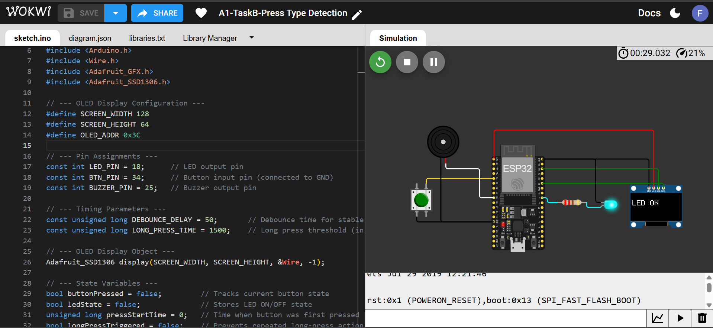
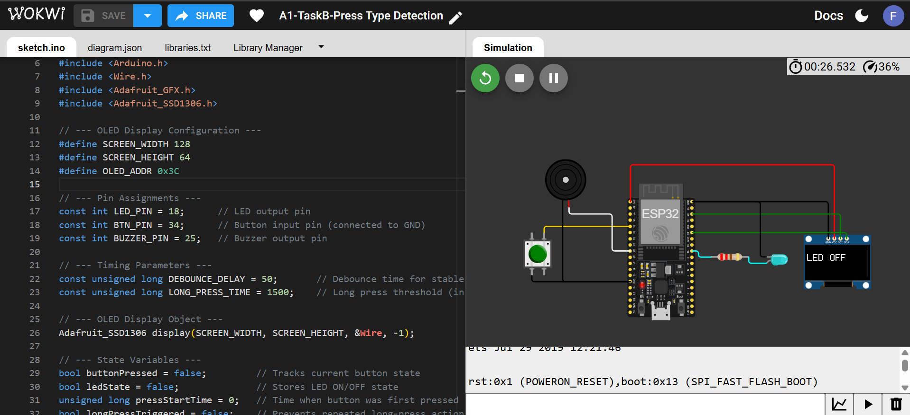

SP32 Press-Type Detection (Short & Long Press)

Name: Fiza Mahboob
Reg. No: 23-NTU-CS-1027
Course: Embedded IoT Systems
Semester: 5th (BSCS-A)
Instructor: Sir Nasir

🔗 Wokwi Simulation Link
[Click to Open Simulation on Wokwi](https://wokwi.com/projects/445820132518696961)

Project Overview
This project demonstrates press-type detection on an ESP32 using a single push button.
The system identifies whether the button is short-pressed or long-pressed based on how long it is held:
Short press (< 1.5 s) → toggles the LED ON/OFF.
Long press (> 1.5 s) → plays a buzzer tone.
An OLED display (SSD1306) shows real-time feedback such as “LED ON”, “LED OFF”, or “BUZZER ON”.

Pin Map
Component	ESP32 Pin	  Description
LED	        GPIO 18	      Turns ON/OFF on short press
Push Button	GPIO 34	      Input button (connected to GND, uses internal pull-up)
Buzzer	    GPIO 25	      Plays tone on long press
OLED SDA	GPIO 21	      I²C data line
OLED SCL	GPIO 22	      I²C clock line
VCC & GND	3.3 V & GND	  Power connections for OLED and components

Screenshots

Key Features
Short and long press detection using millis() timing.
OLED feedback display via Adafruit SSD1306 library.
Debounce handling to prevent false press readings.
Buzzer activation for long press event.
Clean, commented code with modular functions.

How to Run
Open the project in Wokwi using the link above.
Upload the code to the ESP32 Dev Board.
Observe the OLED display and hardware output:
Short press the button → LED toggles ON/OFF.
Long press the button (> 1.5 s) → buzzer plays tone.
The OLED updates to show “LED ON”, “LED OFF”, or “BUZZER ON” accordingly.

Conclusion
This project demonstrates how to use a single input button for multiple actions based on press duration.It combines timing logic, OLED display control, and buzzer output to provide clear, interactive feedback.
Through this implementation, the concept of event-based embedded programming and non-blocking timing using millis() is successfully applied.